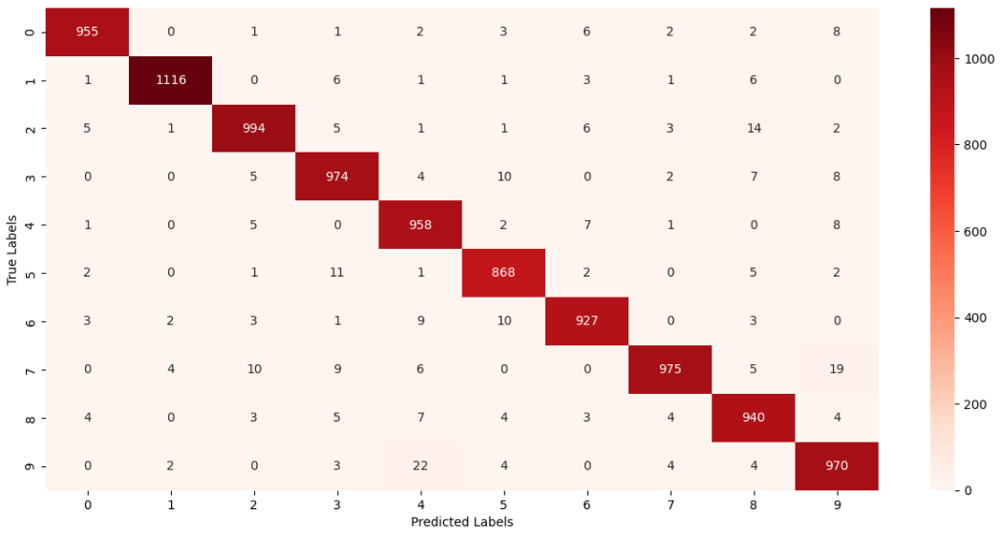

# 🧠 MNIST Digit Classification using Deep Learning

This repository contains a deep learning project that classifies handwritten digits from the MNIST dataset using a neural network.

## 📌 Project Overview and Dataset

The **MNIST dataset** consists of 70,000 images of handwritten digits (0-9). The goal of this project is to train a **deep learning model** to accurately recognize and classify these digits.


## 🚀 Features

- ✅ **Data Preprocessing** – Normalization 
- ✅ **Neural Network Model** – A simple feedforward network built with Keras  
- ✅ **Training & Evaluation** – Model training with accuracy tracking  
- ✅ **Visualization** – Display of training loss/accuracy and sample predictions  
---
## Code details

- imported necessary libraries:
    ```python
    import numpy as np # To visualize single image as array
    import matplotlib.pyplot as plt #To load image
    import seaborn as sns #For confusion matrix
    import cv2 #To load image
    from google.colab.patches import cv2_imshow #In google colab cv2.imshow() function doesn't work directly, this is the alternative way
    from PIL import Image #To save image
    import tensorflow as tf #To load deeplearning model
    tf.random.set_seed(3)
    from tensorflow import keras #In keras, ANN is present
    from keras.datasets import mnist #MNIST dataset import
    from tensorflow.math import confusion_matrix #To load confusion matrix
    ```

- imported dataset:
    ```python
    (X_train, Y_train) , (X_test , Y_test) = mnist.load_data(path="mnist.np2")
    ```

- normalizing value(The whole value now is i range of 0 to 1):
    ```python
    X_test = X_test/255
    X_train = X_train/255
    ```

- Creating Neural Network by four layers:
    ```python
    model = keras.Sequential([
        keras.layers.Flatten(input_shape=(28, 28)),  # MNIST dataset images are 28×28 pixels (grayscale)
        
        # ReLU activation is used in hidden layers because it avoids the vanishing gradient problem 
        keras.layers.Dense(50, activation='relu'),  # 1st hidden layer with ReLU activation
        keras.layers.Dense(50, activation='relu'),  # 2nd hidden layer with ReLU activation
        
        # Softmax is typically used for multi-class classification, but sigmoid is used here
        keras.layers.Dense(10, activation='sigmoid')  # Output layer for 10 classes
    ])
    ```

- Loading loss functions and dependencies:
    ```python
    model.compile(
        optimizer = 'adam',
        loss = 'sparse_categorical_crossentropy',
        metrics = ['accuracy']
    )
    ```

- Training the model:
    ```python
    model.fit(X_train , Y_train, epochs = 15) 
    ```
    Here epoch means, number of times the model visits the whole dataset.

- loss and accuracy is calculated:
    ```python
    loss , accuracy = model.evaluate(X_test, Y_test)
    ```

- Automatic predicting system is built:
    ```python
    input_img = cv2.imread('Any jpg/png formatted image') #Input read by Computer Vision Library
    grayscale_img = cv2.cvtColor(input_img , cv2.COLOR_RGB2GRAY) #As color feature is unnecessary image is converted to grayscale
    grayscale_img_resized = cv2.resize(grayscale_img, (28 , 28)) #Image is converted to 28*28 pixeled image
    grayscale_img_resized = grayscale_img_resized / 255 #Normalized the image
    grayscale_img_resized = np.reshape(grayscale_img_resized , [1 , 28 , 28]) #single image is being predicted, so the image row is 1
    input_prediction = model.predict(grayscale_img_resized) #Probability result among 10classess
    input_prediction = np.argmax(input_prediction) #highest probability is taken among all
    ```
- The result:
    ```python
    #The image visulization:
    plt.imshow(input_img)
    #The predicted result:
    print("The image is predicted as:" , input_prediction)
    ```
- An Example: 
    <br>
    
    <br>
    The image is predicted as: 3

---

## 📊 Model Performance

- **Test Accuracy**: ~96.60%  
- **Loss Reduction**: The model effectively minimizes loss over training epochs.  
- **Prediction Examples**: The model correctly classifies digits from unseen test data.
- **Confusion Matrix**:
<br>

---
## 📸 Sample Results

| Input Image | Model Prediction | Prediction |
|-------------|-----------------|----------------|
|  | `3` | Correct |
|  | `3` | Wrong |

*(More sample results are available in the notebook.)*

## 📖 How to Use


1. **Clone the repository**  
   ```sh
   git clone https://github.com/IsfarNayen/MNIST_Digit_Classification_Deep_Learning_Pet_Project.git
   ```

2. **Open the Jupyter Notebook**
    Navigate to the repository folder and run:
    ```sh
    jupyter notebook MNIST_Digital_Classification.ipynb
    ```
3. **Run the notebook**

## 👤 About Me
- LinkedIn: [Isfar Nayen](https://www.linkedin.com/in/isfar-nayen-0ba8ba341/)
- Kaggle: [Isfar Nayen](https://www.kaggle.com/isfarnayen)
- 🔗 GitHub: [Isfar Nayen](https://github.com/IsfarNayen)
- 📧 Email: isfar8953@gmail.com


---
⭐ If you find this project useful, consider giving it a star! ⭐
